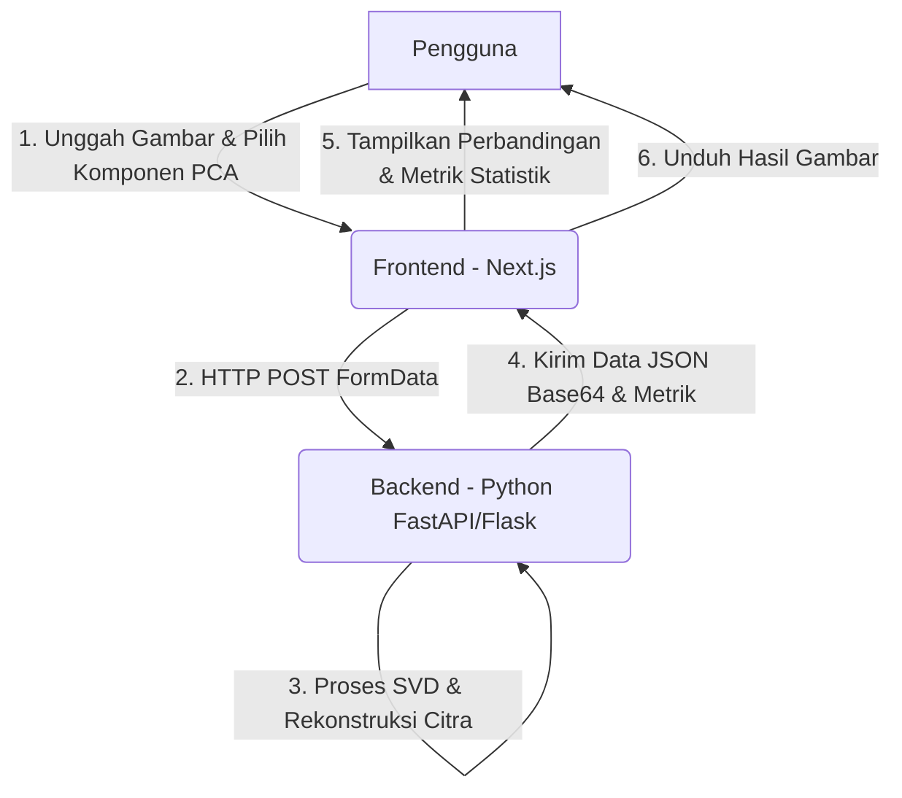

# 🌟 Image Compressor with PCA (Principal Component Analysis)

<p align="center">
  
</p>

<p align="center">
  <strong>Tugas Besar Praktikum Pengolahan Citra Digital</strong><br />
  Aplikasi Web Interaktif untuk Reduksi Dimensi & Kompresi Citra berbasis Principal Component Analysis (PCA) / Singular Value Decomposition (SVD).
</p>

<p align="center">
  
  
  
  
</p>

---

## 📋 Daftar Isi
- [📖 Deskripsi Proyek](#-deskripsi-proyek)
- [🏗️ Arsitektur Proyek](#%EF%B8%8F-arsitektur-proyek)
- [📂 Struktur Proyek](#-struktur-proyek)
- [⚙️ Cara Kerja Sistem](#%EF%B8%8F-cara-kerja-sistem)
- [🚀 Instalasi & Menjalankan](#-instalasi--menjalankan)
  - [1. Setup Frontend (Next.js)](#1-setup-frontend-nextjs)
  - [2. Setup Backend](#2-setup-backend)
- [📘 Panduan Penggunaan](#-panduan-penggunaan)
- [💻 Detail Teknis](#-detail-teknnis)
- [👥 Anggota Kelompok](#-anggota-kelompok)

---

## 📖 Deskripsi Proyek
**Image Compressor** adalah aplikasi web modern berbasis Next.js yang mensimulasikan dan menerapkan kompresi gambar menggunakan metode aljabar linier **Principal Component Analysis (PCA)** melalui pendekatan **Singular Value Decomposition (SVD)**. 

Aplikasi ini bertujuan untuk mendemonstrasikan bagaimana konsep matematika reduksi dimensi dapat digunakan untuk memperkecil ukuran penyimpanan berkas citra digital. Dengan membuang komponen singular yang kurang signifikan, aplikasi dapat mereduksi ukuran gambar dengan tetap mempertahankan informasi visual utama (kualitas gambar) sesuai keinginan pengguna melalui kendali *slider*.

---

## 🏗️ Arsitektur Proyek
Aplikasi ini dikembangkan dengan arsitektur **Client-Server (Decoupled)** di mana frontend dan backend berjalan secara terpisah dan berkomunikasi melalui protokol HTTP (API REST).



- **Frontend (Next.js)**: Menyediakan antarmuka interaktif (UI/UX) berbasis *glassmorphism* mewah yang dinamis untuk mengunggah gambar, menyesuaikan jumlah komponen singular value, melihat statistik perbandingan sebelum/sesudah, dan mengunduh gambar hasil kompresi.
- **Backend (Python)**: Menangani kalkulasi matematis SVD/PCA berintensitas tinggi menggunakan pustaka ilmiah Python (`NumPy`, `SciPy`, `OpenCV` / `Pillow`) dan mengembalikan citra hasil rekonstruksi dalam format Base64 beserta metadata performa.

---

## 📂 Struktur Proyek
Berikut adalah struktur direktori dari repositori frontend ini:

```text
image-compression-frontend/
├── public/                  # Aset publik (logo, gambar anggota, dll.)
│   ├── foto_member_1.jpg
│   ├── foto_member_2.jpg
│   ├── foto_member_3.jpg
│   └── logo-uns-biru.png
├── src/
│   ├── app/                 # Halaman utama dan tata letak (Next.js App Router)
│   │   ├── about/
│   │   │   └── page.tsx     # Halaman profil anggota kelompok
│   │   ├── globals.css      # Gaya global Tailwind CSS
│   │   ├── layout.tsx       # Root layout aplikasi
│   │   ├── template.tsx     # Transisi halaman
│   │   └── page.tsx         # Halaman utama aplikasi Image Compressor
│   └── components/          # Komponen antarmuka yang reusable
│       ├── ComparisonPreview.tsx # Panel perbandingan visual (Before vs After)
│       ├── DownloadButton.tsx    # Tombol untuk mengunduh berkas terkompresi
│       ├── Header.tsx            # Header navigasi & informasi ping backend
│       ├── QualitySlider.tsx     # Slider pengatur jumlah komponen PCA/SVD
│       ├── Stats.tsx             # Panel metrik performa kompresi
│       └── UploadZone.tsx        # Area unggah berkas gambar (drag & drop)
├── package.json             # Konfigurasi dependensi dan skrip proyek
├── next.config.ts           # Konfigurasi Next.js
├── tsconfig.json            # Konfigurasi TypeScript
└── README.md                # Dokumentasi proyek
```

---

## ⚙️ Cara Kerja Sistem
Proses kompresi gambar berbasis PCA/SVD bekerja melalui tahapan berikut:

1. **Representasi Matriks Citra**: Gambar berwarna (RGB) dibaca dan dipecah menjadi tiga matriks 2D terpisah untuk masing-masing saluran warna: **Red (R)**, **Green (G)**, dan **Blue (B)**.
2. **Dekomposisi Nilai Singular (SVD)**: Setiap matriks warna $A$ didekomposisi secara matematis menjadi tiga matriks baru:
   $$A = U \cdot \Sigma \cdot V^T$$
   * Di mana $U$ adalah matriks ortogonal kiri, $V^T$ adalah transpose matriks ortogonal kanan, dan $\Sigma$ adalah matriks diagonal yang berisi *Singular Values* (nilai singular) yang diurutkan dari yang terbesar hingga terkecil.
3. **Reduksi Dimensi (Kompresi)**: Hanya $k$ nilai singular teratas (komponen utama) yang dipertahankan untuk membangun estimasi matriks berderajat rendah (low-rank approximation):
   $$A_k = U_k \cdot \Sigma_k \cdot V_k^T$$
   * Parameter $k$ dikontrol langsung oleh pengguna melalui slider frontend (nilai antara 1 hingga 1000). Nilai $k$ yang lebih kecil menghasilkan kompresi ekstrem (blurry) tetapi ukuran berkas jauh lebih kecil, sedangkan $k$ yang lebih besar menghasilkan kualitas gambar yang sangat mendekati aslinya.
4. **Penggabungan Kembali (Reconstruction)**: Ketiga saluran warna yang telah direkonstruksi ($R_k$, $G_k$, $B_k$) digabungkan kembali menjadi satu citra berwarna utuh.
5. **Kalkulasi Metrik**:
   * **Pixel Difference**: Mengukur persentase perubahan visual (kesalahan rekonstruksi) antara gambar asli dan gambar terkompresi.
   * **Size Saved**: Menghitung efisiensi penyimpanan yang dihemat setelah kompresi.
   * **Compression Time**: Durasi waktu pemrosesan SVD di backend.

---

## 🚀 Instalasi & Menjalankan

### 1. Setup Frontend (Next.js)
Pastikan Anda sudah menginstal [Node.js](https://nodejs.org/) di perangkat Anda.

1. Buka direktori repositori frontend:
   ```bash
   cd image-compression-frontend
   ```
2. Instal semua dependensi Node:
   ```bash
   npm install
   ```
3. Jalankan server pengembangan lokal:
   ```bash
   npm run dev
   ```
4. Akses aplikasi frontend di peramban (browser) melalui:
   [http://localhost:3000](http://localhost:3000)

### 2. Setup Backend
Kode sumber, dokumentasi, dan panduan untuk memasang serta menjalankan server backend Python (FastAPI) tersedia secara terpisah pada repositori berikut:
👉 **[Dezkrazzer/image-compression-backend](https://github.com/Dezkrazzer/image-compression-backend)**

---

## 📘 Panduan Penggunaan
1. **Pilih & Unggah Gambar**: Seret dan letakkan (*drag & drop*) gambar Anda ke dalam zona unggah (*Upload Zone*), atau klik zona tersebut untuk memilih berkas dari komputer Anda (Mendukung PNG, JPG, JPEG, WEBP).
2. **Atur Komponen PCA**: Geser *slider* "Komponen PCA (Singular Values)" untuk menentukan jumlah nilai singular yang ingin dipertahankan (rentang 1 - 1000).
   - Nilai rendah (1-50): Gambar menjadi lebih buram, namun ukuran file turun drastis.
   - Nilai tinggi (100-1000): Gambar menjadi lebih tajam dan mendekati aslinya.
3. **Mulai Kompresi**: Klik tombol **Start Compression**. Sistem akan memproses gambar dan mengirimkannya ke API backend.
4. **Evaluasi Hasil**:
   - Bandingkan perbedaan visual secara bersandingan (*Side-by-Side*) pada panel **Preview Comparison** (Before vs After).
   - Analisis performa kompresi pada panel **Statistik**:
     - **Pixel Difference**: Selisih visual gambar rekonstruksi dengan aslinya.
     - **Compression Time**: Durasi dekomposisi nilai singular di server.
     - **Size Saved**: Persentase penyimpanan yang berhasil dipangkas.
5. **Unduh Gambar**: Klik **Download Compressed** untuk menyimpan gambar hasil reduksi PCA/SVD ke komputer Anda.
6. **Ulangi**: Klik **Reset** untuk membersihkan antrean gambar dan mencoba gambar baru.

---

## 💻 Detail Teknis
* **Frontend Core**: Next.js 16.2 (React 19, TypeScript) menggunakan paradigma App Router.
* **Tampilan & Gaya (CSS)**: Tailwind CSS v4 untuk penataan komponen adaptif modern serta kustomisasi tema gelap (*dark theme*).
* **Animasi**: `motion/react` (Motion v12) untuk transisi halus pada *card*, *slider*, *button*, dan efek *micro-interaction*.
* **Ikon**: `lucide-react` untuk visualisasi ikon antarmuka yang minimalis dan tajam.
* **Indikator Konektivitas (Ping)**: Fitur pengecekan ping *real-time* di pojok kanan atas layar untuk mengukur waktu respons server lokal.

---

## 👥 Anggota Kelompok
Proyek ini dibuat dan dikembangkan oleh **Kelompok 7 - Kelas Informatika D** Universitas Sebelas Maret (UNS):

| Foto Anggota | Nama Lengkap | NIM | Peran Utama | Tautan Profil |
| :---: | :--- | :---: | :--- | :---: |
|  | **Lazuardi Akbar Imani** | L0125105 | Frontend Developer | [🌐 GitHub](https://github.com/Dezkrazzer) • [💼 LinkedIn](https://www.linkedin.com/in/lazuardiakbar/) |
|  | **Muhammad Haidar Ramzy** | L0125109 | Backend Developer | [🌐 GitHub](https://github.com/AiChan277) • [💼 LinkedIn](https://www.linkedin.com/in/muhammad-haidar-ramzy/) |
|  | **Egifrid Angelo Mwoleka** | L0125096 | UI/UX Designer | [🌐 GitHub](https://github.com/mweyunge) • [💼 LinkedIn](https://www.linkedin.com/in/egifrid-mwoleka-5b2a581b5/) |

<p align="center" style="margin-top: 20px;">
  <strong>Program Studi Informatika • Fakultas Teknologi Informasi dan Sains Data</strong><br />
  <strong>Universitas Sebelas Maret (UNS)</strong>
</p>
